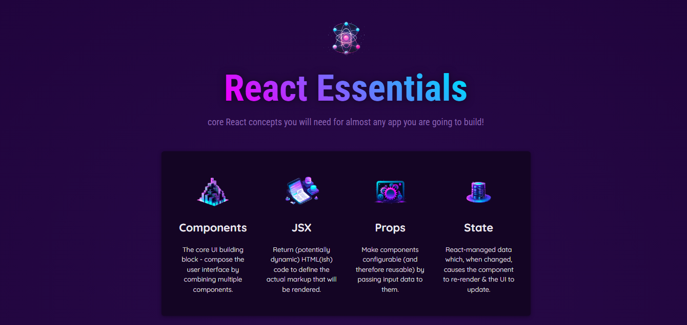
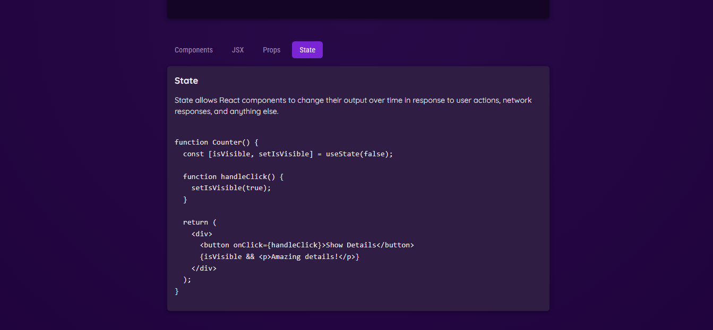

# ReactifyCore

[](https://react.dev/)


ReactifyCore is a responsive and modern React application built to demonstrate and explore essential React concepts. With an interactive design, it provides dynamic examples and an engaging interface to help developers grasp the fundamentals of React.

## Project Overview

### Header



### Tabbed Interface



## Features

- **Responsive Design**: Ensures optimal viewing across devices with a clean and modern layout.
- **Dynamic Header**: Highlights the core purpose with a visually appealing header section featuring a rotating description.
- **Core Concepts Section**: Showcases React essentials through a list of key topics.
- **Tabbed Examples**: Offers an interactive way to explore React concepts like Components, JSX, Props, and State, complete with descriptions and example code snippets.

## Project Structure

ReactifyCore
│ .gitignore
│ .vite.config
│ index.html
│ package-lock.json
│ package.json
│ README.md
│
└───src
│
│ App.jsx
│ data.js
│ index.jsx
│ index.css
│
│
├───assets
│ components.png
│ config.png
│ header.png
│ jsx-ui.svg
│ react-core-concepts.png
│ state-mgmt.png
│ tabbed.png
│
├───components
│ │ Core_concepts.jsx
│ │ CoreConcepts.jsx
│ │ Examples.jsx
│ │ Section.jsx
│ │ TabButton.jsx
│ │ Tabs.jsx
│ │
│ └───Header
│ Header.jsx
│ Header.css

## Installation

To get started with the project locally:

1. Clone the repository:
   ```bash
   git clone https://github.com/SalahShallapy/ReactifyCore.git
   ```
2. Navigate to the project directory:
   ```bash
   cd ReactCorePlayground
   ```
3. Install dependencies:
   ```bash
   npm install
   ```
4. Run the project:
   ```bash
   npm run dev
   ```

## How to Use

- Navigate through the sections to understand React's core principles.
- Use the tabs in the "Examples" section to explore detailed descriptions and code snippets for each React topic.
- Modify the codebase to experiment and build upon the provided examples.

## Contributing

Contributions are what make the open source community such an amazing place to learn, inspire, and create. Any contributions you make are **greatly appreciated**.

If you have a suggestion that would make this better, please fork the repo and create a pull request. You can also simply open an issue with the tag "enhancement".
Don't forget to give the project a star! Thanks!

1. Fork the Project
2. Create your Feature Branch (`git checkout -b feature/AmazingFeature`)
3. Commit your Changes (`git commit -m 'Add some AmazingFeature'`)
4. Push to the Branch (`git push origin feature/AmazingFeature`)
5. Open a Pull Request

<p align="right">(<a href="#top">back to top</a>)</p>
